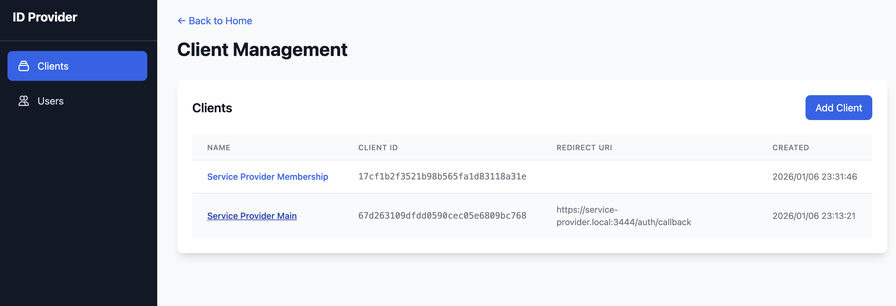
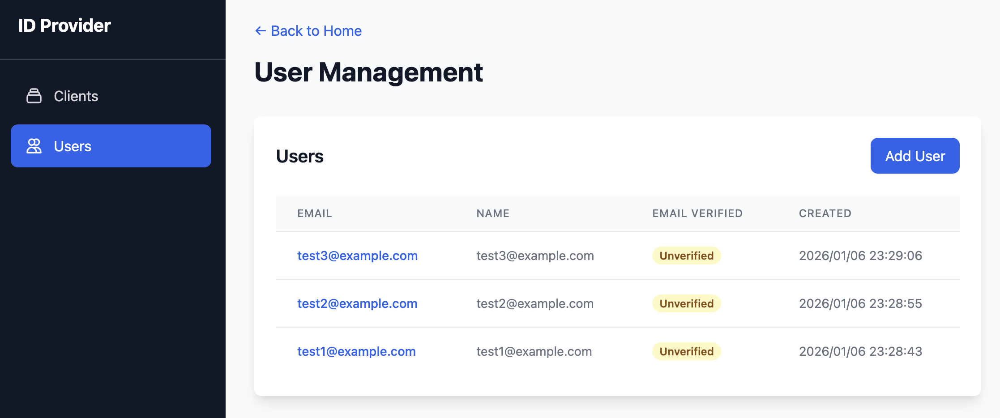
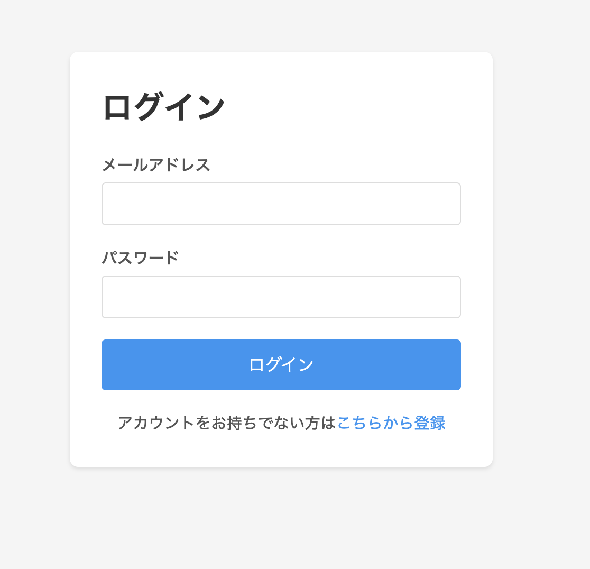
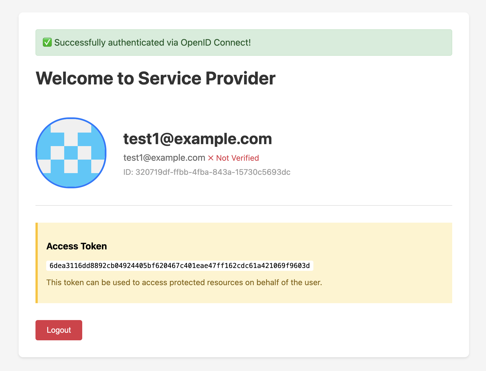
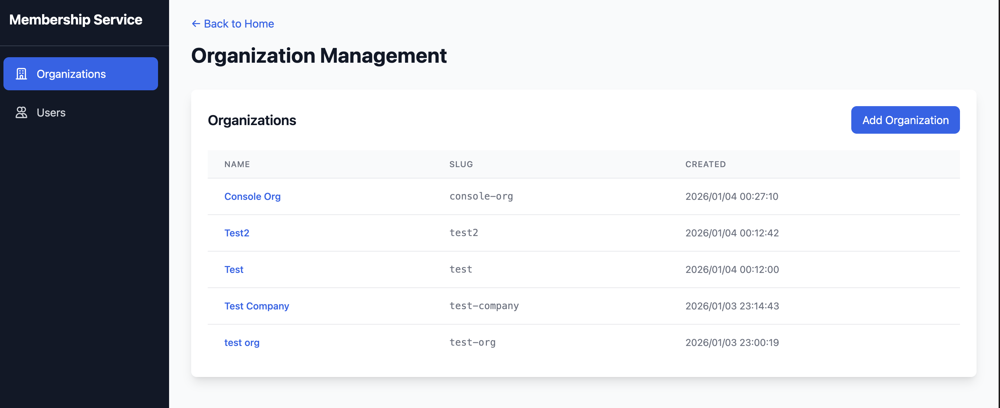
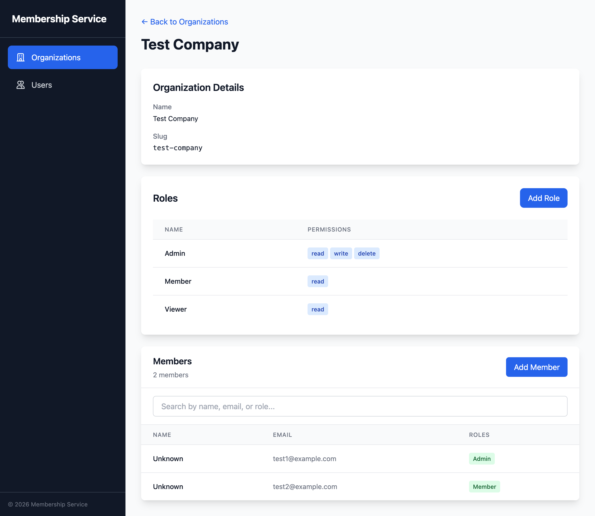
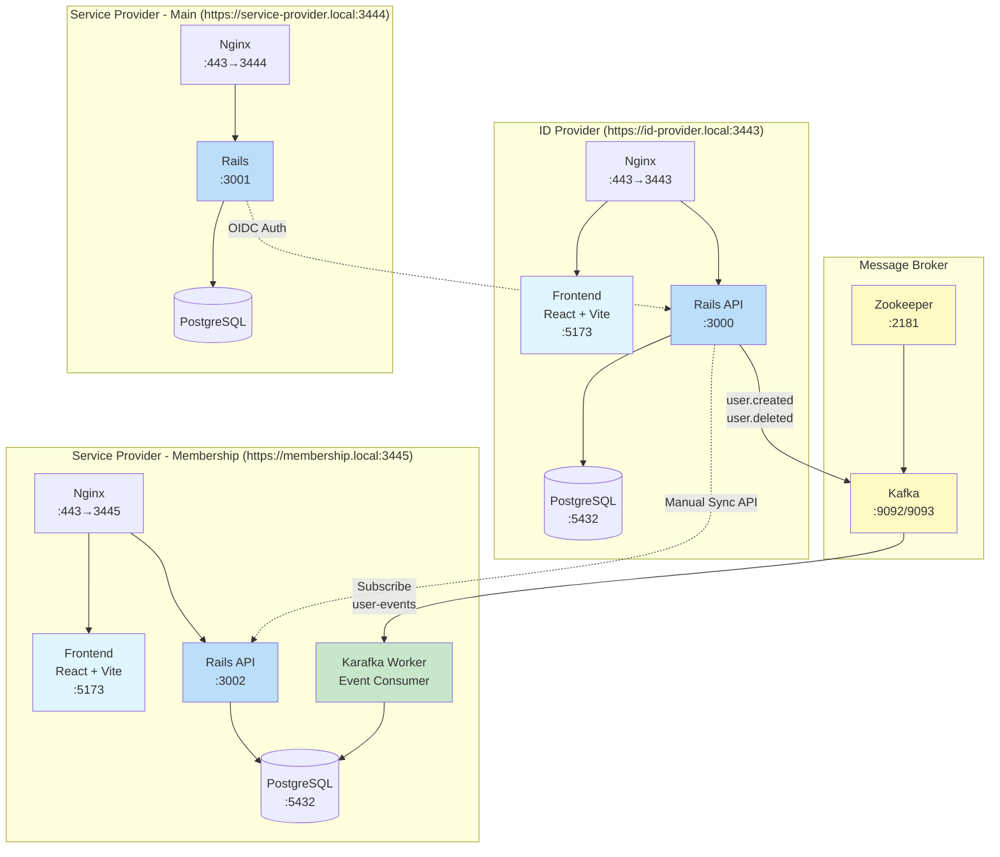

# zero-auth

OpenID Connect (OIDC) を使った認証システムのホビープロジェクトです。

## 構成

このプロジェクトは、マイクロサービスアーキテクチャを採用し、Kafkaを介したイベント駆動のAuthシステムを実現しています。

### サービス一覧

#### **`id-provider/`**: OIDC Identity Provider（認証サーバー）

OIDC ClientとUserを管理しています。

##### Client

Authorization Code FlowとClient Credentials Flowに対応しています。



##### User

Userを保存し、作成・削除時にKafka経由でイベントを発行します。



##### ログイン画面

OIDCによる認証機能を提供します。この画面上から新規作成も可能です。



#### **`service-provider/main/`**: OIDC Client（メインサービス）

id-providerが提供する認証機能を利用するClientです。ログインユーザーの情報を表示します。



#### **`service-provider/membership/`**: Organization/Role/Membership管理サービス

組織とユーザーの所属情報を管理します。ユーザー情報はid-providerを参照しています。

##### 組織管理



組織の詳細画面からUserをMemberに追加できます。



### システム構成図



### データフロー

#### 1. ユーザー認証フロー（OIDC）

```
User → service-provider/main
  ↓
  OIDC認証リクエスト
  ↓
id-provider (認証画面)
  ↓
  ログイン成功
  ↓
id-provider (ID Token発行)
  ↓
  Callback
  ↓
service-provider/main (セッション作成)
```

#### 2. ユーザー同期フロー（イベント駆動）

```
id-provider (User作成/削除)
  ↓
after_commit callback
  ↓
WaterDrop (Kafka Producer)
  ↓
Kafka (user-events topic)
  ↓
Karafka Worker (Consumer)
  ↓
UserSyncService
  ↓
membership DB (User同期)
```

### 技術スタック

| 項目 | 技術 |
|------|------|
| Backend | Ruby on Rails 8.1.1 |
| Frontend | React 19 + Vite + TypeScript |
| Database | PostgreSQL |
| Message Broker | Apache Kafka 7.5.0 + Zookeeper |
| Event Producer | WaterDrop 2.8.15 |
| Event Consumer | Karafka 2.5.4 |
| Reverse Proxy | Nginx (Alpine) |
| SSL/TLS | mkcert (self-signed) |
| Containerization | Docker + Docker Compose |

## セットアップ

### 前提条件

- Docker & Docker Compose
- mkcert (ローカルHTTPS証明書生成用)

### 1. mkcertのインストール

```bash
# macOS
brew install mkcert

# ローカルCAをインストール（初回のみ）
mkcert -install
```

### 2. SSL証明書の生成

**重要**: SSL証明書ファイルは `.gitignore` に含まれているため、生成する必要があります。

プロジェクトルートで実行：

```bash
# sslディレクトリを作成
mkdir -p ssl

# 証明書を生成（すべてのドメインを含む）
cd ssl
mkcert id-provider.local service-provider.local membership.local

# 生成されたファイルを確認
# id-provider.local+2.pem と id-provider.local+2-key.pem が生成される

# mkcertのルート証明書をコピー（Dockerコンテナで証明書検証を行うため）
cp "$(mkcert -CAROOT)/rootCA.pem" .
cd ..
```

### 3. /etc/hostsの設定

ローカルドメインを解決できるように設定：

```bash
sudo sh -c 'echo "127.0.0.1 id-provider.local" >> /etc/hosts'
sudo sh -c 'echo "127.0.0.1 service-provider.local" >> /etc/hosts'
sudo sh -c 'echo "127.0.0.1 membership.local" >> /etc/hosts'
```

### 4. 環境変数の設定

#### id-provider

`id-provider/.env` ファイルを作成（必要に応じて）：

```env
DATABASE_HOST=db
DATABASE_USER=postgres
DATABASE_PASSWORD=postgres
DATABASE_NAME=id_provider_development
RAILS_ENV=development
```

#### service-provider/main

`service-provider/main/.env` ファイルを作成：

```env
RAILS_ENV=development
OIDC_ISSUER=https://id-provider.local:3443
OIDC_CLIENT_ID=your_client_id
OIDC_CLIENT_SECRET=your_client_secret
OIDC_REDIRECT_URI=https://service-provider.local:3444/auth/callback
```

#### service-provider/membership

`service-provider/membership/.env` ファイルを作成：

```env
RAILS_ENV=development
DATABASE_URL=postgres://postgres:postgres@db:5432/membership_development
KAFKA_BROKERS=kafka:9092
ID_PROVIDER_URL=https://id-provider.local:3443
```

### 5. アプリケーションの起動

**重要**: サービスは以下の順番で起動してください：

#### 1. id-provider（Kafka含む）

```bash
cd id-provider
docker compose up -d

# データベースセットアップ
docker compose exec web bin/rails db:create db:migrate
```

アクセス: `https://id-provider.local:3443`

#### 2. service-provider/main

```bash
cd service-provider/main
docker compose up -d

# データベースセットアップ
docker compose exec web bin/rails db:create db:migrate
```

アクセス: `https://service-provider.local:3444`

#### 3. service-provider/membership

```bash
cd service-provider/membership
docker compose up -d

# データベースセットアップ
docker compose exec web bin/rails db:create db:migrate
```

アクセス: `https://membership.local:3445`

**ログ確認**:
```bash
# 各サービスのログを確認
docker compose logs -f

# 特定のコンテナのログ確認
docker compose logs -f web
docker compose logs -f worker  # membershipのみ
```

## 開発環境でのHTTPS通信

開発環境では、mkcertで生成した自己署名証明書を使用してHTTPS通信を行います。

- **id-provider**: `https://id-provider.local:3443`
- **service-provider/main**: `https://service-provider.local:3444`
- **service-provider/membership**: `https://membership.local:3445`

nginxがリバースプロキシとして動作し、SSL終端を行います。

### Dockerコンテナでの証明書検証

`service-provider`は起動時に`id-provider`のOIDC Discovery（`/.well-known/openid-configuration`）にHTTPSでアクセスします。Dockerコンテナ内でmkcertの自己署名証明書を信頼させるため、以下の対応を行っています：

1. mkcertのルート証明書（`rootCA.pem`）を`ssl/`ディレクトリにコピー
2. Dockerfile内でルート証明書をコンテナの`/usr/local/share/ca-certificates/`にコピー
3. `update-ca-certificates`コマンドでシステムのCA証明書ストアに追加

この仕組みにより、コンテナ内のRailsアプリケーションが`https://id-provider.local:3443`に安全にアクセスできます。

## クイックスタート（全サービス起動）

プロジェクト全体を一度に起動する場合：

```bash
# 1. SSL証明書生成（初回のみ）
mkdir -p ssl && cd ssl
mkcert id-provider.local service-provider.local membership.local
cp "$(mkcert -CAROOT)/rootCA.pem" .
cd ..

# 2. id-provider起動（Kafka含む）
cd id-provider
docker compose up -d
docker compose exec web bin/rails db:create db:migrate
cd ..

# 3. membership起動
cd service-provider/membership
docker compose up -d
docker compose exec web bin/rails db:create db:migrate
cd ../..

# 4. main起動
cd service-provider/main
docker compose up -d
docker compose exec web bin/rails db:create db:migrate
cd ../..
```

### アクセスURL

- **id-provider**: https://id-provider.local:3443
- **service-provider/main**: https://service-provider.local:3444
- **service-provider/membership**: https://membership.local:3445

## データベース操作

### データベースリセット

```bash
# 各サービスのディレクトリで実行
docker compose exec web bin/rails db:reset
```

### マイグレーション

```bash
# 新しいマイグレーションを実行
docker compose exec web bin/rails db:migrate

# ロールバック
docker compose exec web bin/rails db:rollback
```

### コンソール

```bash
# Railsコンソール起動
docker compose exec web bin/rails console
```
